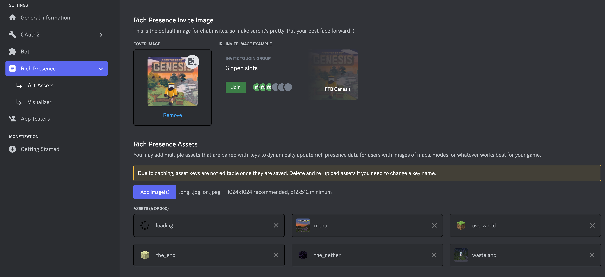

# Simple Discord Rich Presence (SDRP)

[](https://www.curseforge.com/minecraft/mc-mods/simple-discord-rich-presence)
[](https://www.curseforge.com/minecraft/mc-mods/simple-discord-rich-presence)


<p>
<a href="https://maven.nanite.dev/#/releases/com/sunekaer/mods"></a>
<a href="https://www.curseforge.com/minecraft/mc-mods/architectury-api"></a>
<a href="https://fabricmc.net/"></a>
<a href="https://neoforged.net"></a>
<a href="https://files.minecraftforge.net/net/minecraftforge/forge/"></a>
</p>

## What is SDRP?

SDRP is a simple Discord Rich Presence client for Minecraft that allows you to display your current Minecraft status on Discord.

## How do I use SDRP?

- Simply download the mod from CurseForge and put it in your mods folder. This is a client-side only mod so you don't need to install it on your server.
- You will then need to create an application on Discord. You can do this by going to the [Discord Developer Portal](https://discord.com/developers/applications) and clicking "New Application". Give it a name and click "Create".
  - Attach an image to your app on the `General Information` tab. This will be the image that is displayed on Discord when the status is not playing Minecraft.
  - Go to the `Rich Presence` tab and add a new image. This will be the image that is displayed on Discord when the status is playing Minecraft.
- Once you have made your application, you will need to attach images with the correct names for the mod to work. 
  - We've attached example images in the [`images`](./Images) folder. These have the correct names for the mod to work out of the box.
  - A correct configuration will look like this:
    
  - If you want to setup your own images, you can follow the next section.

### Caveats

We always will attempt to use an image called `loading` and an image called `menu` for when the game is loading or is on the main menu respectively. If you do not have these images, the mod will simply fail to display an image for these states.

- `menu` When the main menu is showing
- `loading` When the game is loading


## Using custom images

If you are not using the KubeJS integration then you will need to follow the our convention for naming images and language keys. The convention is as follows:

- Name: `sdrp.[DIMENSION_NAME]` (Language key)
- Image Key: `sdrp.[DIMENSION_NAME].in`
- Image Name: `[DIMESNION_NAME]`

So for this to work, you'd need to have an image added to your Discord apps rich presents settings under the name of the dimension you want to support.

If I wanted to support the end and the overworld for example. Their names are as follows `minecraft:overworld`, `minecraft:the_end`. We ignore the `minecraft:` part and name the images `the_end` and `overworld`. We then add a language key to the language Json for both the `Image Key` and `Name`:

```json
{
  "sdrp.overworld": "Overworld",
  "sdrp.overworld.in": "In the Overworld"
}
``` 

## What we support out of the box

### Dimensions

We omit the `modid` from the dimension name and use the `name` instead. So `minecraft:overworld` becomes `overworld`.

- `overworld`
- `the_nether`
- `the_end`
- `compact_world`
- `dungeon`
- `spatial_storage`
- `otherside`
- `paradise_lost`
- `mining`

*Not all of these dimensions have example images with-in the images folder*

### Languages

```json
{
  "sdrp.logo": "Pack Logo",
  "sdrp.mainmenu": "Main Menu",
  "sdrp.overworld.in": "In Overworld",
  "sdrp.overworld": "Overworld",
  "sdrp.the_nether.in": "In Nether",
  "sdrp.the_nether": "Nether",
  "sdrp.the_end.in": "In The End",
  "sdrp.the_end": "The End",
  "sdrp.compact_world.in": "In Compact World",
  "sdrp.compact_world": "Compact World",
  "sdrp.dungeon.in": "In Dungeon World",
  "sdrp.dungeon": "Dungeon World",
  "sdrp.spatial_storage.in": "In Spatial Storage",
  "sdrp.spatial_storage": "Spatial Storage",
  "sdrp.otherside.in": "In Otherside",
  "sdrp.otherside": "Otherside",
  "sdrp.paradise_lost.in": "In Paradise Lost",
  "sdrp.paradise_lost": "Paradise Lost",
  "sdrp.mining": "Mining Dimension",
  "sdrp.mining.in": "In Mining dimension"
}
```
## Config

```json5
{
  "clientId": 1000000000,   // Your Discord application ID
  "enabled": true,          // Whether or not the mod is enabled
  "screenEvent": false,     // Disables the `menu` and `loading` images
  "clientJoinEvent": false, // Disables the level join events which will prevent the mod from showing the level you are in
  "logState": false,        // Enables developer logging of the state json being sent to Discord
}
```

## KubeJS Integration

> **Note!**
> 
> KubeJS Support is only support in 3.0.0+ for `1.19.2` and `4.0.3+` for `1.20.1+`
> 
> Only `KubeJS 6+` is supported!

Via KubeJS we expose the following methods:

- `SDRP.setState( String message, String imageName, String imageKey )`
  - `message`: message to show under the packname aka "In Overworld" or "In Nether", can be passed a string with the text to show or a lang key. 
  - `imageName`: the text to show when hovering over the small image aka "Overworld" or "Nether", can be passed a string with the text to show or a lang key.
  - `imageKey` : the name Rich Present Art Asset to show, like loading, overworld, menu and so on.

- `SDRP.getCurrentState()`
  - Gets the current state the client is set to.

### 3.0.6+ and 4.0.3+

In 3.0.6+ and 4.0.3+ we expose a couple of new events to help with some KubeJS weirdness as well as the above methods.

`kubejs/startup_script/sdrp.js`

```js
sdrp.dimension_change((event) => {
  const dimPath = event.level.dimension().location().getPath();
  event.updateSDRPState(`sdrp.${dimPath}.in`, `sdrp.${dimPath}`, "dimPath");
});
```

*File path for illustration purposes only, you can put this file anywhere in the `kubejs` folder.*

The `event` object has the following properties:

- `dimensionType`: The dimension the player is in
- `player`: The player object
- `level`: The level object

#### Without our events

Example of how to change the state when a player joins a world.

`kubejs/startup_script/sdrp.js`

```js
// KubeJS 6+
// This might be the wrong event class for 1.20+, I didn't check
ForgeEvents.onEvent('net.minecraftforge.event.entity.EntityJoinWorldEvent', event => {
  if (event.getEntity().type === "entity.minecraft.player") {
    if (event.getWorld().isClientSide()) {
      const dimPath = event.getWorld().dimension().location().getPath();
      SDRP.setState(`sdrp.${dimPath}.in`, `sdrp.${dimPath}`, "dimPath");
    }
  }
})
```
