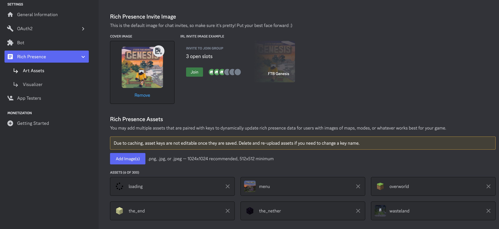

# Simple Discord Rich Presence (SDRP)

[](https://www.curseforge.com/minecraft/mc-mods/simple-discord-rich-presence)
[](https://www.curseforge.com/minecraft/mc-mods/simple-discord-rich-presence)


<p>
<a href="https://maven.nanite.dev/#/releases/com/sunekaer/mods"></a>
<a href="https://www.curseforge.com/minecraft/mc-mods/architectury-api"></a>
<a href="https://fabricmc.net/"></a>
<a href="https://neoforged.net"></a>
</p>

## What is SDRP?

SDRP is a simple Discord Rich Presence client for Minecraft that allows you to display your current Minecraft status on Discord.

## How do I use SDRP?

- Simply download the mod from CurseForge and put it in your mods folder. This is a client-side only mod so you don't need to install it on your server.
- You will then need to create an application on Discord. You can do this by going to the [Discord Developer Portal](https://discord.com/developers/applications) and clicking "New Application". Give it a name and click "Create".
  - Attach an image to your app on the `General Information` tab. This will be the image that is displayed on Discord when the status is not playing Minecraft.
  - Go to the `Rich Presence` tab and add a new image. This will be the image that is displayed on Discord when the status is playing Minecraft.
- Once you have made your application, you will need to attach images with the correct names for the mod to work. 
  - We've attached example images in the [`images`](./Images) folder. These have the correct names for the mod to work out of the box.
  - A correct configuration will look like this:
    
  - If you want to setup your own images, you can follow the next section.

### Caveats

> Versions after `88.0.0` no longer hold the `menu` caveat as this is now controlled via the config.

We always will attempt to use an image called `loading` and an image called `menu` for when the game is loading or is on the main menu respectively. If you do not have these images, the mod will simply fail to display an image for these states.

- `menu` When the main menu is showing
- `loading` When the game is loading


## Dimensions presence

> **Note!**
> This is no longer correct when using versions newer than `88.0.0`.

### `88.0.0+`

> By default, the overworld, nether and end dimensions are configured out of the box.

Dimensions are now controlled either via KubeJS or via the config. The config has advanced support for dimensions which can be read in more detail as part of the config value `dimensionSupport`'s comment. But, here is a extract for simplicity:

```
Dimensions can be setup to update the Rich Presence when the player is in them.

Due to the complex nature of modded dimensions, we've added support for different matchers here with 
support for variable replacement in the various fields.

Note: When comparing, the full dimension identifier is used (e.g. minecraft:overworld, modid:custom_dimension) meaning if you use 
a startsWith, regex, etc, you need to handle the namespace as well. 

Helper matchers are provided for doing blanket matches on just the namespace or path.

Supported matchers:
- exact@<string> : Exact match
- contains@<string> : Contains substring
- startsWith@<string> : Starts with substring
- endsWith@<string> : Ends with substring
- regex@<pattern> : Matches regex pattern (Java regex syntax)
- namespace@<string> : Matches namespace
- path@<string> : Matches path

Variables:
- {{dimension.name}}: The translated dimension name (e.g. dimension.minecraft.overworld = Overworld). This is NeoForge standards, not all mods follow this, nor will all have their own lang keys added. 
- {{dimension.path}}: The dimension identifier (e.g. overworld) excluding the namespace
- {{dimension.namespace}}: The dimension namespace (e.g. minecraft, modid)
- {{dimension.identifier}}: The full dimension identifier (e.g. minecraft:overworld)
- {{player.uuid}}: The player's UUID
- {{player.name}}: The player's in-game name
- Please let us know if there are any other variables you'd like to see added!
```

**Example**
```json5
{
    "matcher": "exact@minecraft:the_nether",
    "message": "Having a blast in {{dimension.name}}",
    "imageName": "{{dimension.name}}",
    "imageKey": "{{dimension.path}}",
    "prefixWithIn": false
}
```

### Before `88.0.0`

If you are not using the KubeJS integration, or at the time of reading this, the version you're using does not support KubeJS, you will need to add images to your Discord app with the following naming scheme:

- Name: `sdrp.[DIMENSION_NAME]` (Language key)
- Image Key: `sdrp.[DIMENSION_NAME].in`
- Image Name: `[DIMESNION_NAME]`

So for this to work, you'd need to have an image added to your Discord apps rich presents settings under the name of the dimension you want to support.

If I wanted to support the end and the overworld for example. Their names are as follows `minecraft:overworld`, `minecraft:the_end`. We ignore the `minecraft:` part and name the images `the_end` and `overworld`. We then add a language key to the language Json for both the `Image Key` and `Name`:

```json
{
  "sdrp.overworld": "Overworld",
  "sdrp.overworld.in": "In the Overworld"
}
```

### Screen presence

When a player is currently on a specific screen, you can define a message, image name and image key for that menu. We support targeting multiple screens per entry.

**Example** 

This is our built in main menu presence:

```json5
{
  "screens": [
    {
      "screenClass": [
        "net.minecraft.client.gui.screens.TitleScreen",
        "net.minecraft.client.gui.screens.multiplayer.JoinMultiplayerScreen",
        "net.minecraft.client.gui.screens.worldselection.SelectWorldScreen"
      ],
      "message": "sdrp.mainmenu",
      "imageName": "sdrp.mainmenu",
      "imageKey": "menu"
    }
  ]
}
```

### Buttons (6.0.2+)

Buttons can be added by adding the following to the mods config file. 

**Restrictions**
- You can have up to 2 buttons. 
- Each button can have a label up to 32 characters long.

If you do not want to have buttons, you can leave the buttons array empty.

```json5
{
  "...": "See above", // See above
  "buttons": [
    {
      "label": "Google",
      "url": "https://www.google.com"
    },
    {
      "label": "Yahoo",
      "url": "https://www.yahoo.com"
    }
  ]
}
```

## KubeJS Integration

> **Note!**
> 
> KubeJS Support is only support in 3.0.0+ for `1.19.2` and `4.0.3+` for `1.20.1+`.
> 
> KubeJS no longer supports Forge or Fabric so support for KubeJS as of `1.20.4+` is limited to just the `NeoForge` version of our mod
> 
> Only `KubeJS 6+` is supported!

Via KubeJS we expose the following methods:

- `SDRP.setState( String message, String imageName, String imageKey )`
  - `message`: message to show under the packname aka "In Overworld" or "In Nether", can be passed a string with the text to show or a lang key. 
  - `imageName`: the text to show when hovering over the small image aka "Overworld" or "Nether", can be passed a string with the text to show or a lang key.
  - `imageKey` : the name Rich Present Art Asset to show, like loading, overworld, menu and so on.

- `SDRP.getCurrentState()`
  - Gets the current state the client is set to.

### 3.0.6+ and 4.0.3+

In 3.0.6+ and 4.0.3+ we expose a couple of new events to help with some KubeJS weirdness as well as the above methods.

`kubejs/startup_script/sdrp.js`

```js
sdrp.dimension_change((event) => {
  const dimPath = event.level.dimension().location().getPath();
  event.updateSDRPState(`sdrp.${dimPath}.in`, `sdrp.${dimPath}`, "dimPath");
});
```

*File path for illustration purposes only, you can put this file anywhere in the `kubejs` folder.*

The `event` object has the following properties:

- `dimensionType`: The dimension the player is in
- `player`: The player object
- `level`: The level object

#### Without our events

Example of how to change the state when a player joins a world.

`kubejs/startup_script/sdrp.js`

```js
// KubeJS 6+
// This might be the wrong event class for 1.20+, I didn't check
ForgeEvents.onEvent('net.minecraftforge.event.entity.EntityJoinWorldEvent', event => {
  if (event.getEntity().type === "entity.minecraft.player") {
    if (event.getWorld().isClientSide()) {
      const dimPath = event.getWorld().dimension().location().getPath();
      SDRP.setState(`sdrp.${dimPath}.in`, `sdrp.${dimPath}`, "dimPath");
    }
  }
})
```
